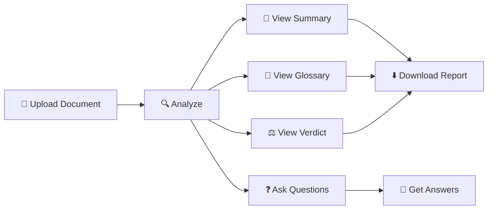

<div align="center">

# 🧾 Legal Document Summarizer Using LLMs
</div>

## 📋 Overview

This project is an AI-powered web application that analyzes legal documents and generates:

✔ **Comprehensive summary**  
✔ **Glossary of legal terms** (simplified explanation)  
✔ **AI-inferred verdict** or outcome  
✔ **Custom Q&A** based on document content  

It supports **PDF, DOCX, and TXT** files and uses **open-source LLMs** to ensure accessibility and scalability.

---

## 🚀 Features

<table>
<tr>
<td width="50%">

### 📝 Summary
Extracts key points, legal facts, issues & arguments from documents

</td>
<td width="50%">

### 📘 Glossary
Identifies and explains complex legal terminology in simple language

</td>
</tr>
<tr>
<td width="50%">

### ⚖️ Verdict Prediction
Infers likely case outcome (non-legal advisory)

</td>
<td width="50%">

### ❓ Q&A
Ask specific questions based on uploaded document

</td>
</tr>
<tr>
<td colspan="2" align="center">

### ⬇️ Save Summary
Generates downloadable results file with timestamp

</td>
</tr>
</table>

---

## 🛠️ Tech Stack

| Category | Tool |
|:--------:|:-----|
| **Framework** |  |
| **AI/LLM Models** | Pegasus-XSum (Summarization), LaMini-T5 (Text Generation) |
| **Document Extractor** | pdfplumber, python-docx |
| **Language** |  |

---

## 📂 Project Structure
```
📁 Legal-Summarizer/
├── 📄 app.py                 # Main application code
├── 📄 requirements.txt       # Dependencies
├── 📄 langflow_prd12.json    # Workflow structure (optional)
└── 📄 README.md              # Documentation
```

---

## ⚙️ Installation & Setup

### 🔹 1️⃣ Clone the Repository
```bash
git clone https://github.com/<your-username>/<repo-name>.git
cd <repo-name>
```

### 🔹 2️⃣ Install Dependencies
```bash
pip install -r requirements.txt
```

### 🔹 3️⃣ Run the Application
```bash
python app.py
```

The Gradio interface will open in your browser:

👉 **http://127.0.0.1:7860/**

---

## 📌 Usage Instructions

<div align="center">


</div>

1️⃣ **Upload** a legal document (PDF/DOCX/TXT)  
2️⃣ Click **Analyze Document**  
3️⃣ **View** the results:
   - 📄 Extracted text
   - 📝 AI summary
   - 📘 Glossary
   - ⚖️ Predicted verdict

4️⃣ **Ask** follow-up questions for deeper insights  
5️⃣ **Download** the generated report if needed

---

## 🌐 Models Used

<table>
<thead>
<tr>
<th>Model</th>
<th>Purpose</th>
<th>Details</th>
</tr>
</thead>
<tbody>
<tr>
<td><code>google/pegasus-xsum</code></td>
<td>📝 Summarization</td>
<td>High quality extractive & abstractive summarization</td>
</tr>
<tr>
<td><code>MBZUAI/LaMini-T5-738M</code></td>
<td>🤖 Text Generation</td>
<td>Legal glossary + verdict reasoning</td>
</tr>
</tbody>
</table>

---

<div align="center">


</div>
